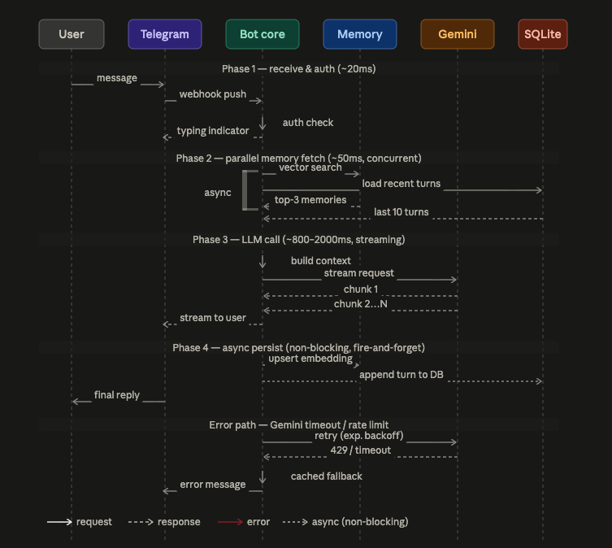
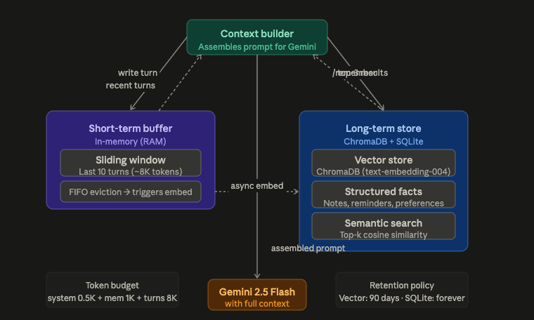

## ภาพรวม Architecture:
ระบบแบ่งเป็น 4 layer หลัก — Telegram edge, Bot processing, AI/Memory core, และ Persistence ทุก layer ออกแบบให้ fail gracefully และ respond ภายใน 3 วินาทีสำหรับ 95th percentile



จุดสำคัญของ flow:

- Phase 2 ทำ concurrently — vector search + load turns พร้อมกัน ประหยัด ~30–50ms
- Phase 3 ใช้ streaming — user เห็น response แบบ progressive ไม่รอ full generation
- Phase 4 เป็น fire-and-forget — persist หลัง reply ออกไปแล้ว ไม่ block latency

---

จากนั้น memory system ที่เป็น core ของ "personal" ในตัว assistant:



---

## System Requirements

### Functional Requirements

| ID | Requirement |
|---|---|
| FR-01 | รับ text, image, voice message จาก Telegram |
| FR-02 | จำบริบทบทสนทนาย้อนหลัง 10 turns (short-term) |
| FR-03 | จำข้อมูลระยะยาวผ่าน `/remember` และ semantic retrieval |
| FR-04 | ตั้ง reminder และ nudge อัตโนมัติ (APScheduler) |
| FR-05 | รองรับ multimodal — ส่งรูปแล้ว Gemini วิเคราะห์ได้ |
| FR-06 | stream response กลับ Telegram แบบ progressive |
| FR-07 | whitelist user_id — ไม่รับ request จากคนอื่น |

### Non-Functional Requirements

| ID | Requirement | Target |
|---|---|---|
| NFR-01 | P95 response latency | < 3s (ไม่นับ Gemini generation time) |
| NFR-02 | Availability | > 99% (personal use, downtime < 7h/month) |
| NFR-03 | Memory footprint | < 200MB RAM |
| NFR-04 | Storage growth | < 100MB/month (vector + SQLite) |
| NFR-05 | Gemini quota headroom | < 500 req/day (ห่างไกล 1,500 limit) |
| NFR-06 | Cold start time | < 5s |

### Implementation Checklist

```
Phase 1 — Core (Week 1)
├── aiogram 3.x bot skeleton + webhook/polling
├── Auth middleware (whitelist)
├── Gemini client (streaming)
└── Basic chat handler

Phase 2 — Memory (Week 2)
├── Short-term buffer (deque, 10 turns)
├── ChromaDB setup + text-embedding-004
├── SQLite schema (notes, reminders, prefs)
└── Context builder

Phase 3 — Features (Week 3)
├── /remember, /recall, /note commands
├── APScheduler reminders
├── Image/multimodal handler
└── /summary weekly digest

Phase 4 — Reliability (Week 4)
├── Exponential backoff (tenacity)
├── Gemini rate-limit handler
├── Structured logging (structlog)
└── Health check endpoint
```

---